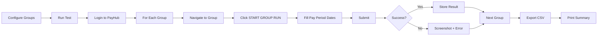

# 🤖 Group Run Automation - Complete Solution

## 📋 What Was Created

I've created a **complete automation solution** to start group runs for multiple calculation set groups without manual intervention.

### ✅ Files Created

```
tests/
├── start-group-runs.spec.ts              # Main automation script
├── group-run-config.ts                   # Configuration file
├── GROUP_RUN_AUTOMATION_GUIDE.md         # Complete documentation
├── helpers/
│   └── find-group-ids.spec.ts            # Helper to discover group IDs
GROUP_RUN_QUICK_REF.md                    # Quick reference card
GROUP_RUN_AUTOMATION_SUMMARY.md           # This file
```

---

## 🎯 What It Does

### Problem Solved
Instead of manually:
1. ❌ Navigating to each group
2. ❌ Clicking "START GROUP RUN"
3. ❌ Entering pay period dates
4. ❌ Clicking submit
5. ❌ Repeating for 10+ groups...

### Automated Solution
✅ **One command** runs all groups automatically  
✅ **Configurable** pay periods  
✅ **CSV export** of all results  
✅ **Error screenshots** for debugging  
✅ **Retry logic** for reliability  
✅ **Parallel or sequential** execution  

---

## 🚀 Quick Start (3 Steps)

### Step 1: Find Your Group IDs (2 minutes)
```bash
npx playwright test tests/helpers/find-group-ids.spec.ts -g "Discover"
```

This will:
- Login to PayHub
- List all your calculation set groups
- Extract their IDs
- Generate config code for you

**Output example:**
```
1. KWFHBW - Pay Process
   ID: 5
   URL: /calculation-set-groups/5

2. SLFCAB - Pay Process
   ID: 789fea8e
   URL: /calculation-set-groups/789fea8e
```

### Step 2: Configure Your Groups (3 minutes)
Edit `tests/group-run-config.ts`:

```typescript
export const ALL_GROUP_RUNS = [
  {
    groupName: 'KWFHBW - Pay Process',
    groupId: '5',                      // ← From step 1
    payPeriodStart: '10/07/2026',      // ← Your start date
    payPeriodEnd: '10/07/2026',        // ← Your end date
    description: 'KWFHBW Weekly Run',
    enabled: true,
    tags: ['weekly']
  },
  // Paste the rest from find-group-ids output
];
```

### Step 3: Run! (1 command)
```bash
# Test with one group first
npx playwright test start-group-runs.spec.ts -g "single" --headed

# Run all groups
npx playwright test start-group-runs.spec.ts -g "all"
```

**Done! All your groups are running!** 🎉

---

## 📊 What You Get

### Console Output
```
==============================================================
Processing: KWFHBW - Pay Process
Pay Period: 10/07/2026 - 10/07/2026
==============================================================

✅ Success: KWFHBW - Pay Process
   Run ID: 8272a547
   Message: Group run started successfully

======================================================================
📊 GROUP RUN SUMMARY
======================================================================
Total Groups: 5
✅ Successful: 5
❌ Failed: 0
======================================================================
```

### CSV Export
**File:** `test-results/group-runs-[timestamp].csv`

```csv
Group Name,Success,Run ID,Message,Timestamp
"KWFHBW - Pay Process",true,8272a547,"Success",2026-05-20T10:30:00Z
"SLFCAB - Pay Process",true,8272a548,"Success",2026-05-20T10:32:00Z
```

### Screenshots
- Success snapshots
- Error screenshots with timestamp
- Full page captures for debugging

---

## 🎯 Features

### ✅ Multiple Groups
Run 1 or 100 groups with one command

### ✅ Configurable Dates
Set different pay periods per group or update all at once

### ✅ Enable/Disable
Temporarily disable groups without deleting configuration

### ✅ Tags
Organize groups (weekly, monthly, urgent, etc.)

### ✅ Error Handling
- Automatic screenshots on failures
- Detailed error messages
- Retry logic
- CSV logging

### ✅ Scheduling Ready
Integrate with Task Scheduler or CI/CD

---

## 📖 Example Scenarios

### Scenario 1: Weekly Pay Run (All Groups, Same Period)
```bash
# 1. Update pay period in config for all groups
# 2. Run command:
npx playwright test start-group-runs.spec.ts -g "all"
```

### Scenario 2: Different Pay Periods per Group
```typescript
// In group-run-config.ts
{
  groupName: 'Weekly Group',
  payPeriodStart: '10/07/2026',
  payPeriodEnd: '10/13/2026',
},
{
  groupName: 'Bi-weekly Group',
  payPeriodStart: '10/07/2026',
  payPeriodEnd: '10/20/2026',
}
```

### Scenario 3: Run Only Urgent Groups
```typescript
// Tag groups as 'urgent'
tags: ['urgent']

// Filter and run
import { getGroupsByTag } from './tests/group-run-config';
const urgentGroups = getGroupsByTag('urgent');
```

---

## 🛠️ Configuration Options

### Update All Pay Periods at Once
```typescript
import { updateAllPayPeriods, WEEKLY_PAY_PERIODS } from './tests/group-run-config';

// Option 1: Specific dates
const groups = updateAllPayPeriods('10/07/2026', '10/13/2026');

// Option 2: Use predefined periods
const groups = updateAllPayPeriods(
  WEEKLY_PAY_PERIODS.week1.start,
  WEEKLY_PAY_PERIODS.week1.end
);
```

### Enable/Disable Groups
```typescript
{
  groupName: 'Test Group',
  enabled: false,  // ← Skip this group
  // ...
}
```

### Environment Configuration
Create `.env` file:
```bash
ASHLEY_USERNAME=your.email@ashleyfurniture.com
ASHLEY_PASSWORD=your_password
TEST_ENV=stage  # or 'dev' or 'prod'
```

---

## 📚 Documentation

| File | Purpose |
|------|---------|
| `GROUP_RUN_QUICK_REF.md` | Quick reference card |
| `tests/GROUP_RUN_AUTOMATION_GUIDE.md` | Complete documentation |
| `GROUP_RUN_AUTOMATION_SUMMARY.md` | This overview |

---

## 🎓 How It Works



---

## 💡 Best Practices

1. **Test with one group first**
   ```bash
   npx playwright test start-group-runs.spec.ts -g "single" --headed
   ```

2. **Use version control** for your config
   ```bash
   git add tests/group-run-config.ts
   git commit -m "Update pay periods for week of 10/07"
   ```

3. **Check CSV after each run**
   ```bash
   cat test-results/group-runs-*.csv
   ```

4. **Use tags** to organize
   ```typescript
   tags: ['weekly', 'production', 'urgent']
   ```

5. **Keep credentials secure**
   - Use `.env` file
   - Add `.env` to `.gitignore`
   - Never commit passwords

---

## ⏰ Scheduling

### Option 1: Windows Task Scheduler
1. Create new task
2. Trigger: Weekly, Monday 8:00 AM
3. Action: Run program
   - Program: `powershell.exe`
   - Arguments: `-Command "cd C:\Users\JJesudoss\playwright-new; npx playwright test start-group-runs.spec.ts -g 'all'"`

### Option 2: Manual Weekly
Just run this command every week:
```bash
npx playwright test start-group-runs.spec.ts -g "all"
```

---

## 🔍 Troubleshooting

### Can't find group IDs?
```bash
npx playwright test tests/helpers/find-group-ids.spec.ts -g "Discover"
```

### Login fails?
Update `.env` with correct credentials

### Wrong date format?
Check existing runs to see the format used

### Need help?
Read the full guide:
```bash
cat tests/GROUP_RUN_AUTOMATION_GUIDE.md
```

---

## 📈 Benefits

| Before (Manual) | After (Automated) |
|----------------|-------------------|
| 5-10 min per group | 1 command for all |
| Error-prone | Reliable |
| No audit trail | CSV export |
| Tedious | Automated |
| Hard to repeat | Repeatable |

---

## ✅ Verification

After running, verify:
- [ ] Check console output for success messages
- [ ] Review CSV file in `test-results/`
- [ ] Verify runs in PayHub UI
- [ ] Check screenshots if any failures

---

## 🎉 You're Ready!

**Your complete workflow:**

```bash
# 1. Find your group IDs (one time)
npx playwright test tests/helpers/find-group-ids.spec.ts -g "Discover"

# 2. Configure groups in group-run-config.ts (one time)

# 3. Every week:
npx playwright test start-group-runs.spec.ts -g "all"

# 4. Check results:
cat test-results/group-runs-*.csv
```

**That's it! You've automated your group runs!** 🚀

---

**Questions?**
- Quick Reference: `GROUP_RUN_QUICK_REF.md`
- Full Guide: `tests/GROUP_RUN_AUTOMATION_GUIDE.md`

**Happy Automating!** 🎉
